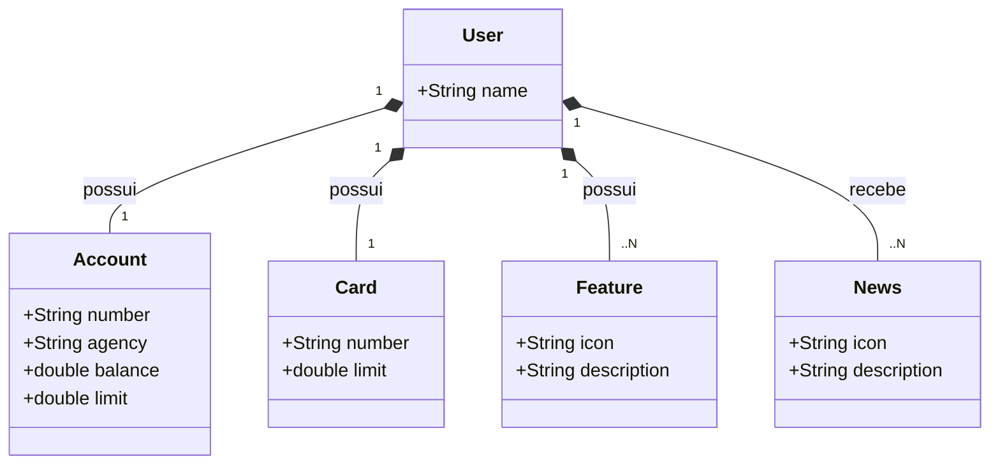

# Santander BootCamp DIO
Projeto API RESTful com Java e Spring

## Diagrama de Classes

```mermaid
classDiagram
    class User {
        +String name
    }

    class Account {
        +String number
        +String agency
        +double balance
        +double limit
    }

    class Card {
        +String number
        +double limit
    }

    class Feature {
        +String icon
        +String description
    }

    class News {
        +String icon
        +String description
    }

    User "1" *-- "1" Account : possui
    User "1" *-- "1" Card : possui
    User "1" *-- "..N" Feature : possui
    User "1" *-- "..N" News : recebe
```
