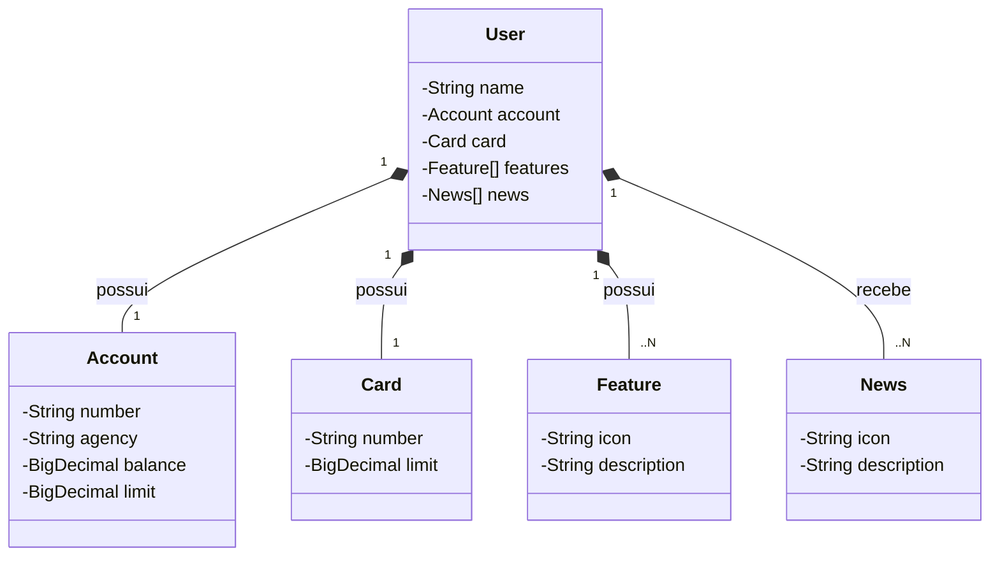

# Santander BootCamp DIO
Projeto API RESTful com Java e Spring

## Acesso da API em produção

Railway: [https://santander-bootcamp-dio-2025.up.railway.app/swagger-ui.html](https://santander-bootcamp-dio-2025.up.railway.app/swagger-ui.html)

## Diagrama de Classes

